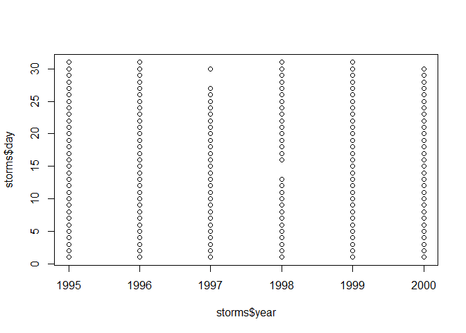

hw01\_nasaweather
================
Chenchen Guo
2018 Sep 15th

R Markdown
----------

Install the nasaweather package firstly

``` r
library(nasaweather)
```

Data set: Storm
---------------

Information of data set storms of package nasaweather

``` r
str(storms)
```

    ## Classes 'tbl_df', 'tbl' and 'data.frame':    2747 obs. of  11 variables:
    ##  $ name    : chr  "Allison" "Allison" "Allison" "Allison" ...
    ##  $ year    : int  1995 1995 1995 1995 1995 1995 1995 1995 1995 1995 ...
    ##  $ month   : int  6 6 6 6 6 6 6 6 6 6 ...
    ##  $ day     : int  3 3 3 3 4 4 4 4 5 5 ...
    ##  $ hour    : int  0 6 12 18 0 6 12 18 0 6 ...
    ##  $ lat     : num  17.4 18.3 19.3 20.6 22 23.3 24.7 26.2 27.6 28.5 ...
    ##  $ long    : num  -84.3 -84.9 -85.7 -85.8 -86 -86.3 -86.2 -86.2 -86.1 -85.6 ...
    ##  $ pressure: int  1005 1004 1003 1001 997 995 987 988 988 990 ...
    ##  $ wind    : int  30 30 35 40 50 60 65 65 65 60 ...
    ##  $ type    : chr  "Tropical Depression" "Tropical Depression" "Tropical Storm" "Tropical Storm" ...
    ##  $ seasday : int  3 3 3 3 4 4 4 4 5 5 ...

``` r
head(storms)
```

    ##      name year month day hour  lat  long pressure wind                type
    ## 1 Allison 1995     6   3    0 17.4 -84.3     1005   30 Tropical Depression
    ## 2 Allison 1995     6   3    6 18.3 -84.9     1004   30 Tropical Depression
    ## 3 Allison 1995     6   3   12 19.3 -85.7     1003   35      Tropical Storm
    ## 4 Allison 1995     6   3   18 20.6 -85.8     1001   40      Tropical Storm
    ## 5 Allison 1995     6   4    0 22.0 -86.0      997   50      Tropical Storm
    ## 6 Allison 1995     6   4    6 23.3 -86.3      995   60      Tropical Storm
    ##   seasday
    ## 1       3
    ## 2       3
    ## 3       3
    ## 4       3
    ## 5       4
    ## 6       4

``` r
ncol(storms)
```

    ## [1] 11

``` r
nrow(storms)
```

    ## [1] 2747

``` r
summary(storms)
```

    ##      name                year          month             day       
    ##  Length:2747        Min.   :1995   Min.   : 6.000   Min.   : 1.00  
    ##  Class :character   1st Qu.:1995   1st Qu.: 8.000   1st Qu.: 9.00  
    ##  Mode  :character   Median :1997   Median : 9.000   Median :18.00  
    ##                     Mean   :1997   Mean   : 8.803   Mean   :16.98  
    ##                     3rd Qu.:1999   3rd Qu.:10.000   3rd Qu.:25.00  
    ##                     Max.   :2000   Max.   :12.000   Max.   :31.00  
    ##       hour             lat             long            pressure     
    ##  Min.   : 0.000   Min.   : 8.30   Min.   :-107.30   Min.   : 905.0  
    ##  1st Qu.: 3.500   1st Qu.:17.25   1st Qu.: -77.60   1st Qu.: 980.0  
    ##  Median :12.000   Median :25.00   Median : -60.90   Median : 995.0  
    ##  Mean   : 9.057   Mean   :26.67   Mean   : -60.87   Mean   : 989.8  
    ##  3rd Qu.:18.000   3rd Qu.:33.90   3rd Qu.: -45.80   3rd Qu.:1004.0  
    ##  Max.   :18.000   Max.   :70.70   Max.   :   1.00   Max.   :1019.0  
    ##       wind            type              seasday     
    ##  Min.   : 15.00   Length:2747        Min.   :  3.0  
    ##  1st Qu.: 35.00   Class :character   1st Qu.: 84.0  
    ##  Median : 50.00   Mode  :character   Median :103.0  
    ##  Mean   : 54.68                      Mean   :102.6  
    ##  3rd Qu.: 70.00                      3rd Qu.:125.0  
    ##  Max.   :155.00                      Max.   :185.0

Variance of pressure
--------------------

Calculating the variance with one method and var function of pressure which belongs to storm data set

``` r
na_pres<- storms$pressure
length(na_pres)
```

    ## [1] 2747

``` r
max(na_pres)
```

    ## [1] 1019

``` r
min(na_pres)
```

    ## [1] 905

``` r
ave<- (sum(na_pres)/(length(na_pres)))
diffs<- (na_pres-ave)
variance<- (sum(diffs^2)/(length(na_pres)-1))
variance
```

    ## [1] 349.4912

``` r
var(na_pres)
```

    ## [1] 349.4912

Plots
-----

Indicate the length of every storm of each year

``` r
str(storms)
```

    ## Classes 'tbl_df', 'tbl' and 'data.frame':    2747 obs. of  11 variables:
    ##  $ name    : chr  "Allison" "Allison" "Allison" "Allison" ...
    ##  $ year    : int  1995 1995 1995 1995 1995 1995 1995 1995 1995 1995 ...
    ##  $ month   : int  6 6 6 6 6 6 6 6 6 6 ...
    ##  $ day     : int  3 3 3 3 4 4 4 4 5 5 ...
    ##  $ hour    : int  0 6 12 18 0 6 12 18 0 6 ...
    ##  $ lat     : num  17.4 18.3 19.3 20.6 22 23.3 24.7 26.2 27.6 28.5 ...
    ##  $ long    : num  -84.3 -84.9 -85.7 -85.8 -86 -86.3 -86.2 -86.2 -86.1 -85.6 ...
    ##  $ pressure: int  1005 1004 1003 1001 997 995 987 988 988 990 ...
    ##  $ wind    : int  30 30 35 40 50 60 65 65 65 60 ...
    ##  $ type    : chr  "Tropical Depression" "Tropical Depression" "Tropical Storm" "Tropical Storm" ...
    ##  $ seasday : int  3 3 3 3 4 4 4 4 5 5 ...

``` r
plot(storms$year,storms$day)
```


